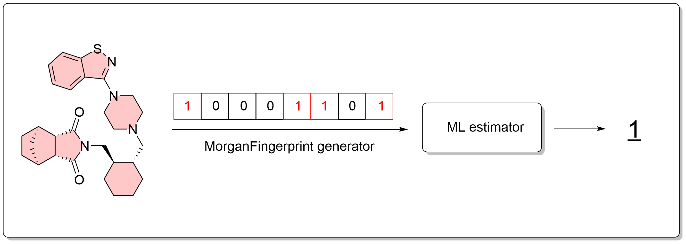

# Description

This toolkit introduces a machine learning pipeline designed for small drug screening. It includes:  

1. A Jupyter Notebook for data parsing and preprocessing, model evaluation, optimization, and saving.  
2. An Object-Oriented Programming (OOP) script (`ml_launcher.py`) that uses the trained estimator to make predictions locally on the user’s computer. Users can also modify the notebook to run predictions within a Google Colab environment if desired.  

The model is a binary classifier that predicts bioactivity, returning:  
- **1** for active compounds (Ki ≤ 50 nM).  
- **0** for inactive compounds (Ki > 50 nM).  

The example dataset focuses on the **5-HT7 receptor**, which demonstrates the workflow but can be adapted to predict bioactivity for any biological target. Notably, the 5-HT7 dataset includes a relatively small number of molecules (177 after preprocessing) and exhibits some class imbalance (active vs. inactive). Consequently, predictions may be suboptimal. Thus, this toolkit serves as an example of a fingerprints-based binary classifier. For other biological targets, different models might perform better. Therefore, it’s crucial to evaluate and select the most suitable estimator for each target.



---

# Instructions  

To run the `ml_launcher.py` script, ensure the following files are in the same directory:  
- `ml_launcher.py` (script for making predictions).  
- `best_rfc_model.joblib` (the trained estimator).  
- `example.csv` (the file containing molecules to be analyzed).  

## Requirements Installation   

If necessary, install the required Python packages using the following command:  

```python
pip install pandas numpy rdkit joblib
```

Once the required packages are installed, you can run the script in your local environment.  

---

# List of Files  

1. **5ht7_IC50.csv** - raw dataset from ChEMBL.  
2. **5ht7_Ki.csv** - raw dataset from ChEMBL.  
3. **ml_notebook.ipynb** - Jupyter Notebook containing the model definition and training pipeline.  
4. **best_rfc_model.joblib** - trained and saved estimator.  
5. **example.csv** - example file with molecules for prediction.  
6. **ml_launcher.py** - python script for running predictions.
7. **fps_esti_schema.png** - scheme.
